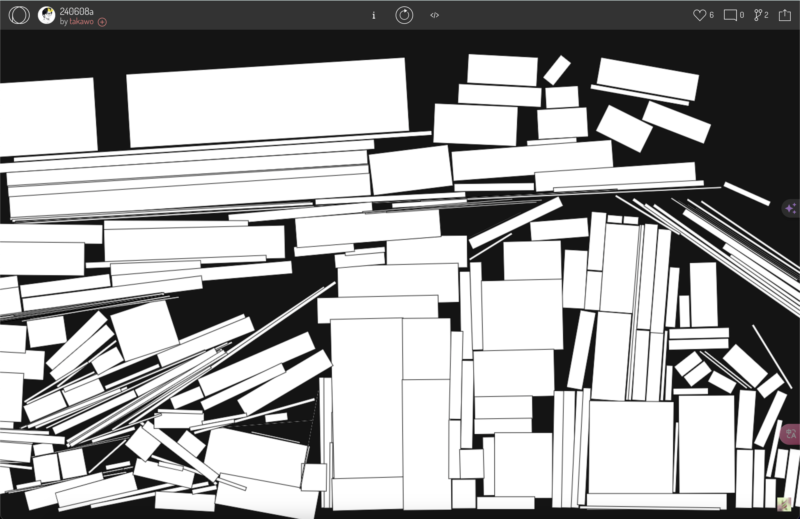
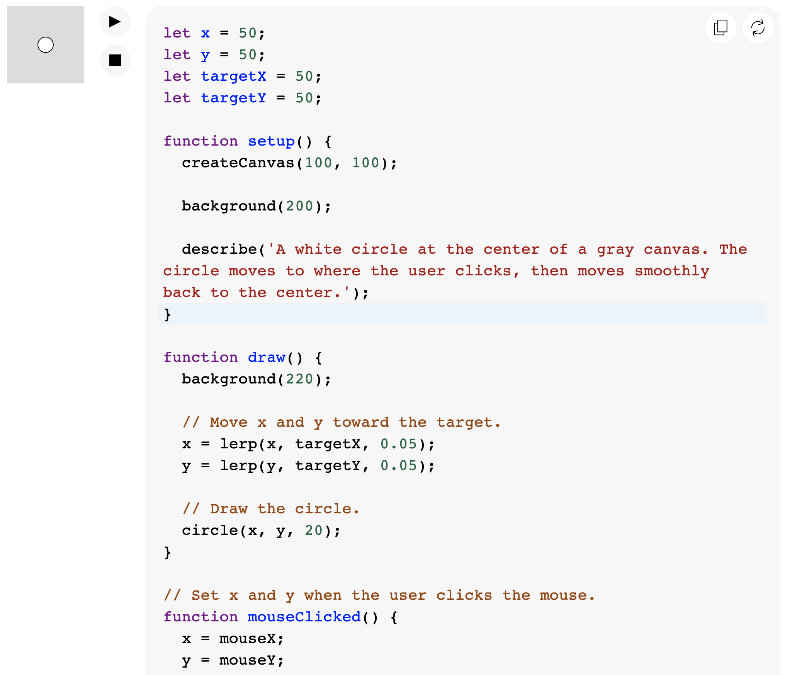
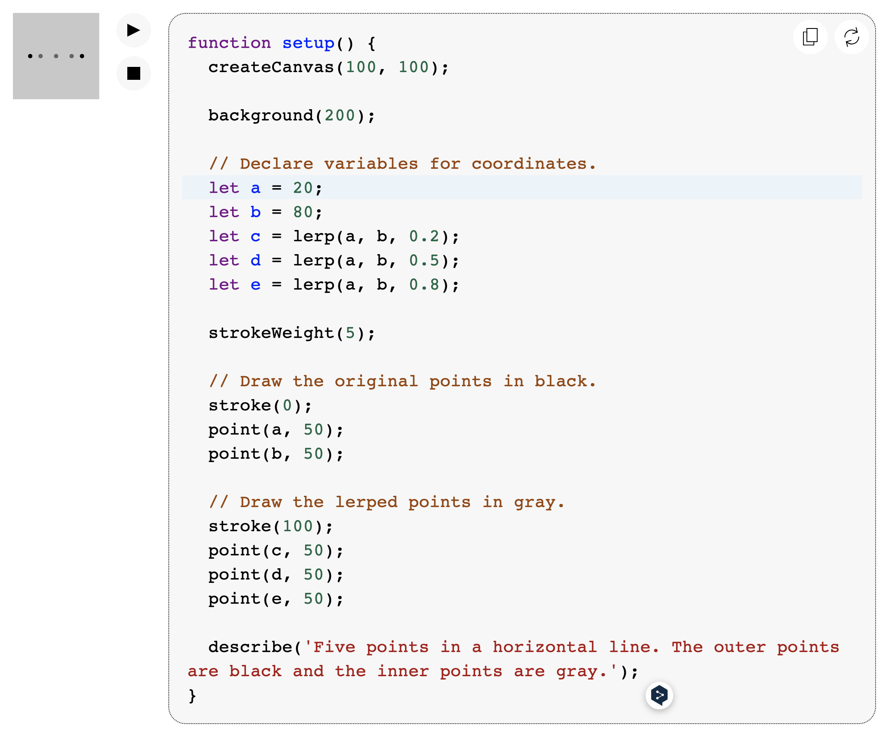

# xche0213_9103_Quiz 8
Here is a part of ideas of my project!

### Part 1 - Imaging Technique Inspiration

#### 1. Inspiration
From these two works, I was particularly inspired by the effect of **falling fonts or objects.** By disintegrating and falling, it conveys a dynamic visual change, **bringing life to an otherwise static element.**
- *[Inspiration1 Link](https://openprocessing.org/sketch/2289715)*
- *[Inspiration2 Link](https://openprocessing.org/sketch/2295575)*
#### 2. Incorporate
I would like to apply a similar technique in my project by gradually dispersing or sinking the text or shapes to **simulate the phenomenon of gravity or erosion in nature.**

This not only **enhances the interactivity** of the work, but also echoes the theme of natural processes and change in environmental animation through this gradual dynamic effect, bringing the audience **a visual experience of continuous change!**

### Part 2 - Coding Technique Exploration

#### 1. Coding Technique

One coding technique to achieve smooth object sliding or falling effects is using **lerp()**. This function gradually adjusts an object’s position between two points, creating fluid, natural movements.

- *[A link to this example code](https://p5js.org/reference/p5/lerp/)*

#### 2. Desired Effect

 By applying it to x or y coordinates, I can simulate smooth, gravity-affected motion in animations, enhancing realism and visual appeal. This technique can be implemented in **p5.js or Processing**, contributing to the desired soft, gradual falling effect in my project.

- *[A link to this example code](https://p5js.org/reference/p5/lerp/)*